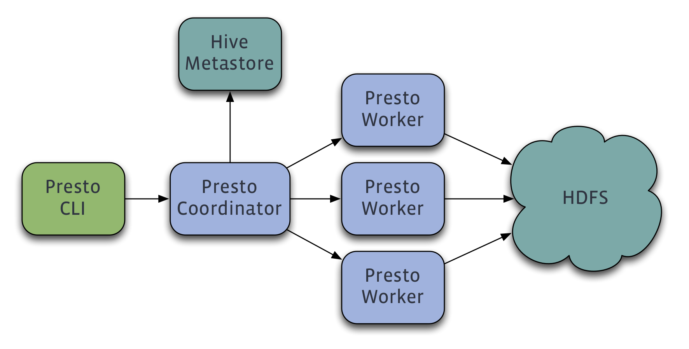

# 概述

## PRESTO是什么？

Presto是一个由 `Facebook` 开源的分布式SQL查询引擎，适用于交互式分析查询，数据量支持GB到PB字节。

Presto的设计和编写完全是为了解决像Facebook这样规模的商业数据仓库的交互式分析和处理速度的问题。

## 它可以做什么？

Presto支持在线数据查询，包括Hive, Cassandra, 关系数据库以及专有数据存储。 一条Presto查询可以将多个数据源的数据进行合并，可以跨越整个组织进行分析。

Presto以分析师的需求作为目标，他们期望响应时间小于1秒到几分钟。 Presto终结了数据分析的两难选择，要么使用速度快的昂贵的商业方案，要么使用消耗大量硬件的慢速的“免费”方案。

## 谁在使用它？

Facebook使用Presto进行交互式查询，用于多个内部数据存储，包括300PB的数据仓库。 每天有1000多名Facebook员工使用Presto，执行查询次数超过30000次，扫描数据总量超过1PB。

领先的互联网公司包括Airbnb和Dropbox都在使用Presto。

> Presto令人吃惊。 首席工程师Andy Kramolisch刚在生产环境使用了几天。 在大多数情况下它比Hive快几个数量级。 与Redshift不同，它直接从HDFS读取数据，在使用前不需要大量的ETL操作，就可以工作。
>
> - Christopher Gutierrez, 在线分析经理, Airbnb

> 我们对Presto感到非常兴奋。 我们打算用它快速获取用户使用Dropbox的不同方式，以及诊断他们遇到的问题。 在我们目前的测试中，它应用于某些最重要的特别用例，它表现稳定并且非常快。
>
> - Fred Wulff, 软件工程师, Dropbox

## 什么是PRESTO基金会？

Presto基金会是为支持Presto开源项目的开发人员和社区流程而成立的非营利组织。[在Linux基金会](https://linuxfoundation.org/)的主持下，Presto基金会受到公开透明的管理。

如果您认同我们对Presto的愿景，并准备为社区发展过程提供财务支持，请 [加入我们！](https://prestodb.io/join.html)

## 介绍

Presto是在机器集群上运行的分布式系统。完整的安装包括 `Coordinator` 和多个 `Worker`。查询是从 `Client`（例如Presto CLI）提交给 `Coordinator` 的。`Coordinator` 进行解析，分析并执行查询计划计划，然后分发处理队列给 `Worker`。

## 需求

Presto的基本需求

- Linux or Mac OS X
- Java 8, 64-bit
- Python 2.4+

## 连接器

Presto支持插接式连接器提供的数据。 各连接器的设计需求会有所不同。

### HADOOP / HIVE

Presto支持从以下版本的Hadoop中读取Hive数据：

- Apache Hadoop 1.x
- Apache Hadoop 2.x
- Cloudera CDH 4
- Cloudera CDH 5

支持以下文件类型：Text, SequenceFile, RCFile, ORC 和 Parquet

此外，需要有远程的Hive元数据。 不支持本地或嵌入模式。 Presto不使用MapReduce，只需要HDFS。

### CASSANDRA

必须有Cassandra 2.x。 这种连接器完全不依赖Hive连接器，只需要一个安装好的Cassandra。

### TPC-H

TPC-H连接器动态生成数据，可以用于实验与测试Presto。 此连接器没有额外要求。

## 部署

详细的部署方法见 [Presto部署](docs/deployment.md) 说明。

## 执行查询

完成Presto部署后，你可以使用 [命令行接口](docs/cli.md) 执行查询。

